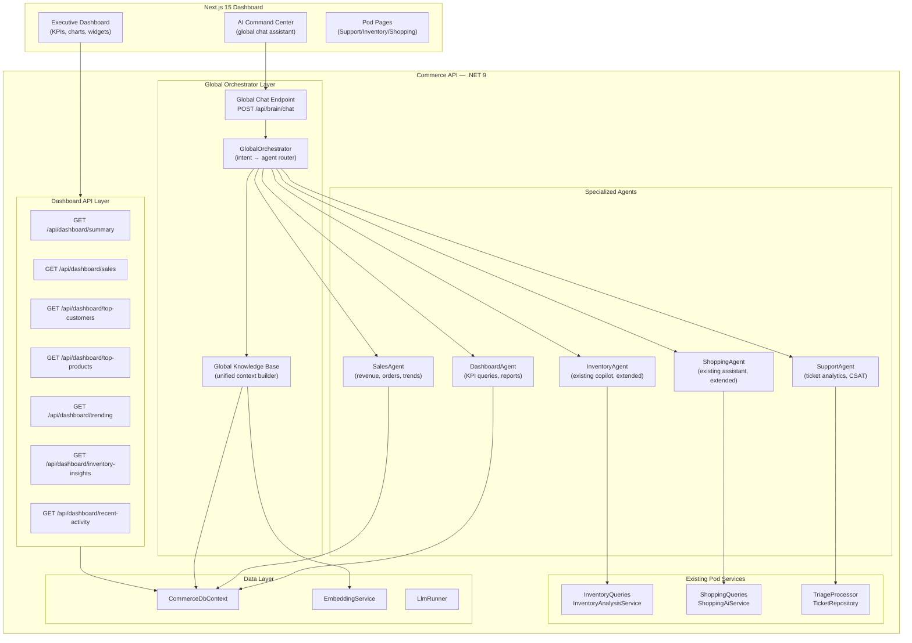
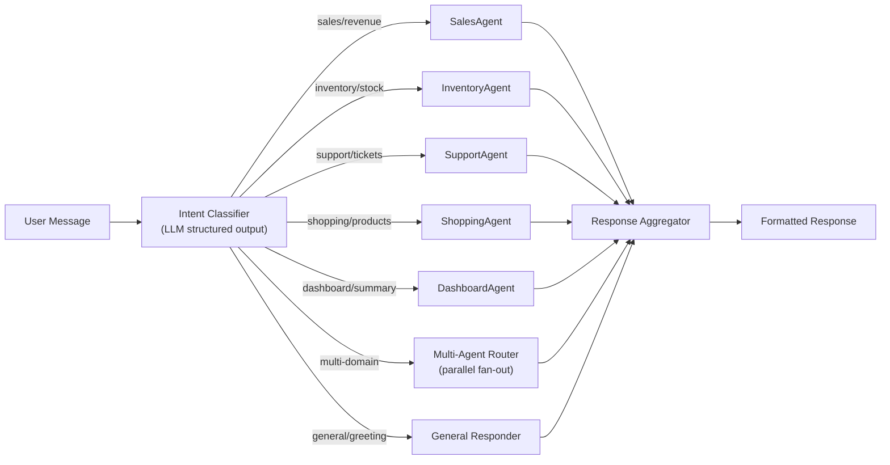
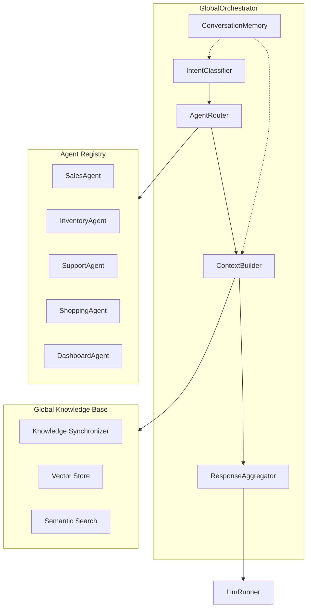
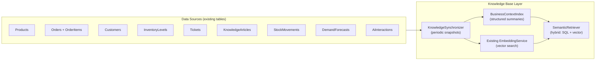
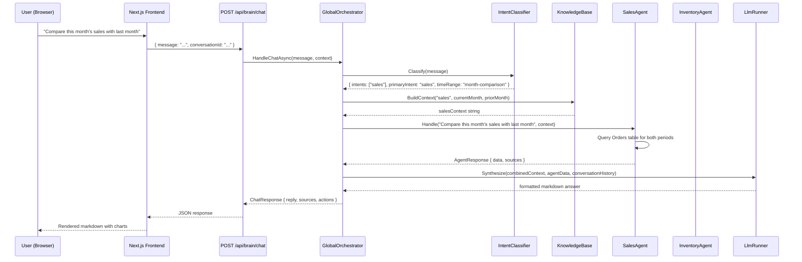

# CommercePilot — Executive Dashboard, AI Chat, Global Orchestrator & Knowledge Base

> Architecture proposal based on analysis of all implemented modules (Support AI Phase 1a ✅, Inventory AI Phase 2 ✅, Shopping AI Phase 3 ✅).

---

## 1. Current System Inventory

Before designing the new layers, here is what exists today:

### Backend (Commerce API — .NET 9 / FastEndpoints / SQL Server LocalDB)

| Module | Endpoints | Domain Entities | AI Services | Workers |
|--------|-----------|----------------|-------------|---------|
| **Support AI** | `POST /api/support/triage`, `GET /api/support/tickets`, `GET /api/support/tickets/{id}`, `GET /api/support/routing-rules` | Ticket, RoutingRule | TriageClassifier (LLM classification) | TriageWorker |
| **Inventory AI** | `GET /api/inventory/products`, `GET /api/inventory/health`, `GET /api/inventory/forecast`, `GET /api/inventory/alerts`, `POST /api/inventory/alerts/{id}/ack`, `GET /api/inventory/reorder-suggestions`, `POST /api/inventory/copilot` | InventoryLevel, StockMovement, DemandForecast, InventoryAlert, ReorderSuggestion | InventoryCopilotService (RAG+LLM) | InventoryAnalysisWorker, ModelKeepWarmWorker |
| **Shopping AI** | `GET /api/shopping/search`, `GET /api/shopping/recommendations`, `GET /api/shopping/trending`, `POST /api/shopping/events`, `GET /api/shopping/customers`, `POST /api/shopping/assistant`, `POST /api/shopping/compare` | CustomerEvent, Recommendation, AbandonedCart | ShoppingAiService (semantic search, RAG assistant, compare) | RecommendationWorker, CartRecoveryWorker, EmbeddingWarmupWorker |
| **Platform** | `GET /api/status`, `GET /api/notifications`, `POST /api/notifications/{id}/ack` | Product, Category, Customer, Order, OrderItem, Warehouse, Supplier, KnowledgeArticle, EmbeddingChunk, AiInteraction, Notification | EmbeddingService, LlmRunner, LlmClientFactory | EventDispatcherService |

### Frontend (Next.js 15 / Tailwind / Shadcn/UI / TanStack Query)

| Route | Purpose | Status |
|-------|---------|--------|
| `/` | Executive Dashboard (ticket stats + notifications only) | Minimal placeholder |
| `/support` | Support AI — ticket list, filters, submit dialog | ✅ |
| `/support/[id]` | Ticket detail view | ✅ |
| `/inventory` | Inventory health, alerts, reorders, product table | ✅ |
| `/inventory/forecast` | Demand forecast chart | ✅ |
| `/inventory/copilot` | Natural language inventory Q&A | ✅ |
| `/shopping` | Semantic search, recommendations, trending | ✅ |
| `/shopping/assistant` | RAG-powered shopping assistant | ✅ |
| `/analytics` | Placeholder | ❌ |
| `/settings` | Placeholder | ❌ |

### Data Foundation

- **18 database tables** covering products, orders, customers, inventory, support, knowledge, embeddings, AI telemetry
- **Event bus** (in-process `Channel<T>` behind `IEventBus`): `TicketCreated`, `TicketEscalated`, `StockLow`
- **Embedding pipeline**: document ingestion → chunking → embedding (nomic-embed-text) → vector search (in-memory cosine, 768 dims)
- **LLM abstraction**: `IChatClient` → Ollama (default) / OpenAI / Gemini toggle
- **Seeded demo data**: 5 brands, products, customers, orders, stock movements, knowledge articles

---

## 2. Proposed Architecture — High-Level View



---

## 3. Executive Dashboard Design

### 3.1 Layout (4-Zone Grid)

```
┌─────────────────────────────────────────────────────────────────────┐
│  TOP BAR: Period Selector (Today/Week/Month/Quarter/Year/Custom)   │
│           + AI Chat Toggle + Notifications                         │
├────────────────────────┬────────────────────────────────────────────┤
│                        │                                           │
│   ZONE A: KPI Cards    │   ZONE B: Revenue & Orders Chart          │
│   (4 primary metrics)  │   (area chart, dual axis)                 │
│                        │                                           │
├────────────────────────┴────────────────────────────────────────────┤
│                                                                     │
│   ZONE C: Business Intelligence Grid (3 columns)                   │
│   ┌──────────────┬──────────────┬──────────────┐                   │
│   │ Top Products │ Top Custs    │ Inventory    │                   │
│   │ (bar chart)  │ (ranked list)│ Health Ring  │                   │
│   ├──────────────┼──────────────┼──────────────┤                   │
│   │ Trending     │ Support      │ AI Usage     │                   │
│   │ Products     │ Overview     │ & Cost       │                   │
│   └──────────────┴──────────────┴──────────────┘                   │
│                                                                     │
├─────────────────────────────────────────────────────────────────────┤
│   ZONE D: Activity Stream + Alerts                                 │
│   (recent orders, tickets, inventory alerts, system events)        │
└─────────────────────────────────────────────────────────────────────┘
│                AI Chat Panel (slide-in from right edge)             │
```

### 3.2 KPI Cards (Zone A)

| KPI | Source Tables | Calculation | Visual |
|-----|-------------|-------------|--------|
| **Total Revenue** | `Orders` + `OrderItems` | `SUM(quantity * unitPrice)` for period | $ amount + % change vs prior period, sparkline |
| **Orders** | `Orders` | `COUNT(*)` for period | Count + % change, sparkline |
| **Inventory Health** | `InventoryLevel` cache | Pre-computed score from `HealthSummary.HealthScore` | Score/100 + gauge micro-chart |
| **Active Tickets** | `Tickets` | `COUNT(*) WHERE status IN ('Queued','Triaged','Escalated')` | Count + urgency breakdown dot |

### 3.3 Charts & Visualizations

| Widget | Chart Type | Library | Data Source |
|--------|-----------|---------|-------------|
| **Revenue & Orders Trend** | Dual-axis area chart (revenue line + orders bars) | Chart.js or Recharts | `Orders` grouped by day/week/month |
| **Top Products** | Horizontal bar chart | Chart.js | `OrderItems` → `SUM(quantity)` top 10 |
| **Top Customers** | Ranked list with avatars + spend | Custom card | `Orders` → `SUM(total)` top 10 by `CustomerId` |
| **Inventory Health** | Doughnut/ring chart (stock classes) | Chart.js | `InventoryProductRow.Classification` distribution |
| **Trending Products** | Card carousel with flame icon | Custom | `/api/shopping/trending` |
| **Support Snapshot** | Stacked bar (ticket statuses) | Chart.js | `Tickets` by status |
| **AI Usage** | Line + bar combo (calls vs cost) | Chart.js | `AiInteractions` aggregated |
| **Activity Stream** | Timeline list | Custom | Union of recent orders, tickets, alerts |

### 3.4 Period Selector Logic

The period selector applies globally to all dashboard widgets via a React context or Zustand store:

```
periods = [
  { label: "Today",    range: [startOfDay, now] },
  { label: "This Week",  range: [startOfWeek, now] },
  { label: "This Month", range: [startOfMonth, now] },
  { label: "This Quarter", range: [startOfQuarter, now] },
  { label: "This Year",  range: [startOfYear, now] },
  { label: "Custom",   range: [userPick, userPick] },
]
```

Every dashboard API endpoint accepts `from` and `to` query parameters.

---

## 4. Dashboard API Endpoints

> [!IMPORTANT]
> All new endpoints go in `Commerce.Api/Features/Dashboard/` following the existing FastEndpoints REPR pattern. Queries are read-only SQL projections — no new domain entities needed.

### 4.1 Proposed Endpoints

| Endpoint | Method | Response Shape | Description |
|----------|--------|---------------|-------------|
| `/api/dashboard/summary` | GET | `DashboardSummary` | All KPI cards in one call (revenue, orders, profit, health score, active tickets, growth %) |
| `/api/dashboard/sales` | GET | `SalesTrend` | Revenue + order count by period bucket (day/week/month) with comparison to prior period |
| `/api/dashboard/top-customers` | GET | `TopCustomer[]` | Top N customers by total spend in period |
| `/api/dashboard/top-products` | GET | `TopProduct[]` | Top N products by quantity sold in period |
| `/api/dashboard/trending` | GET | (delegates to existing) | Proxy to `/api/shopping/trending` |
| `/api/dashboard/inventory-insights` | GET | `InventoryInsights` | Stock class distribution + critical alerts count |
| `/api/dashboard/recent-activity` | GET | `ActivityItem[]` | Unified feed: recent orders, tickets, alerts, reorder suggestions |
| `/api/dashboard/support-snapshot` | GET | `SupportSnapshot` | Ticket counts by status + avg resolution time + CSAT proxy |
| `/api/dashboard/ai-usage` | GET | `AiUsageStats` | Calls, tokens, cost, latency by feature and time bucket |

### 4.2 Query Parameters (common)

```
?from=2026-07-01T00:00:00Z&to=2026-07-20T00:00:00Z&granularity=day
```

### 4.3 Sample Response DTOs

```csharp
// Commerce.Application/Abstractions/DashboardContracts.cs

public sealed record DashboardSummary(
    decimal Revenue, decimal RevenuePriorPeriod, double RevenueGrowthPct,
    int OrderCount, int OrderCountPriorPeriod, double OrderGrowthPct,
    int InventoryHealthScore, int ActiveTicketCount,
    int LowStockAlerts, int EscalatedTickets);

public sealed record SalesBucket(DateOnly Date, decimal Revenue, int Orders);
public sealed record SalesTrend(
    IReadOnlyList<SalesBucket> Current,
    IReadOnlyList<SalesBucket> Prior);

public sealed record TopCustomer(
    Guid CustomerId, string Name, string Email,
    decimal TotalSpend, int OrderCount);

public sealed record TopProduct(
    Guid ProductId, string Name, string Brand, string Sku,
    int QuantitySold, decimal Revenue);

public sealed record ActivityItem(
    string Type, string Title, string Description,
    string Severity, DateTimeOffset Timestamp, Guid? ReferenceId);
```

---

## 5. AI Chat Assistant Architecture

### 5.1 Design Philosophy

The AI Chat is **not** another siloed copilot — it is a **unified command center** that sits atop all modules. The user types natural language; the orchestrator classifies intent, routes to the appropriate agent(s), aggregates results, and responds with a formatted answer including data, charts, and action links.

### 5.2 Chat Endpoint

```
POST /api/brain/chat
{
  "message": "What is the sales report for the current month?",
  "conversationId": "optional-guid-for-context",
  "context": { "currentPage": "/inventory" }  // optional UI context
}

Response:
{
  "reply": "## Monthly Sales Report (July 2026)\n\nTotal revenue: **$47,230**...",
  "sources": [{ "title": "Orders table", "kind": "database" }],
  "actions": [{ "label": "View full report", "route": "/analytics/sales" }],
  "chartData": { ... },  // optional structured data for inline charts
  "conversationId": "guid"
}
```

### 5.3 Intent Classification & Routing



**Intent Classification Prompt** (structured output):

```
Classify the user's business question into one or more domains:
- sales: revenue, orders, profit, growth, sales reports
- inventory: stock levels, forecasts, reorder, dead stock, health
- support: tickets, resolution, CSAT, escalation, routing
- shopping: products, search, trending, recommendations, compare
- dashboard: overall business performance, summaries, KPIs
- general: greetings, help, capabilities

Output JSON: { "intents": ["sales", "inventory"], "primaryIntent": "sales" }
```

### 5.4 Agent Architecture

Each agent is a C# class implementing `IBusinessAgent`:

```csharp
public interface IBusinessAgent
{
    string Domain { get; }  // "sales", "inventory", etc.
    Task<AgentResponse> HandleAsync(string question, ChatContext context, CancellationToken ct);
}

public sealed record AgentResponse(
    string Answer,
    IReadOnlyList<Source> Sources,
    IReadOnlyList<ActionLink> Actions,
    object? ChartData);
```

| Agent | Backed By | Capabilities |
|-------|-----------|-------------|
| `SalesAgent` | Direct SQL on `Orders`, `OrderItems`, `Customers` | Revenue summaries, period comparisons, top customers, sales reports |
| `InventoryAgent` | Wraps existing `IInventoryQueries` + `IInventoryCopilot` | Health reports, stock alerts, reorder status, demand forecasts |
| `SupportAgent` | Direct SQL on `Tickets`, `Notifications` | Ticket analytics, resolution rates, urgency distribution, CSAT |
| `ShoppingAgent` | Wraps existing `IShoppingAi` + `IShoppingQueries` | Product search, trending, recommendations, comparisons |
| `DashboardAgent` | Direct SQL across all tables | Cross-module summaries, combined KPI reports |

### 5.5 Conversation Memory

For multi-turn conversations:

```csharp
public sealed class ChatContext
{
    public Guid ConversationId { get; set; }
    public List<ChatMessage> History { get; set; } = [];  // last N turns
    public string? CurrentPage { get; set; }              // UI context
    public DateTimeOffset SessionStart { get; set; }
}
```

> [!NOTE]
> In-memory conversation store (keyed by `ConversationId`, TTL = 30 min) for Phase 1. Move to Redis-backed store when Phase 4 deploys Redis.

---

## 6. Global Orchestrator Architecture

### 6.1 Core Design



### 6.2 Orchestrator Flow (per request)

1. **Receive** message + conversationId
2. **Build context**: load conversation history from memory, resolve current user/page context
3. **Classify intent**: LLM structured output → `{ intents[], primaryIntent, timeRange?, entities[] }`
4. **Route**: select 1–N agents based on intents
5. **Execute agents** (parallel where independent): each agent queries data, builds a factual context string
6. **Aggregate**: merge agent responses into a unified context document
7. **Generate response**: LLM synthesizes the unified context into a natural language answer with markdown formatting
8. **Store**: update conversation memory
9. **Return**: formatted response + sources + suggested actions + optional chart data

### 6.3 Component Responsibilities

| Component | Responsibility |
|-----------|---------------|
| `IntentClassifier` | LLM-powered structured classification of user message into domains + time ranges + named entities |
| `AgentRouter` | Maps classified intents to registered `IBusinessAgent` instances; handles multi-agent fan-out |
| `ContextBuilder` | Injects conversation history, user context, and knowledge base context into the prompt |
| `ResponseAggregator` | Merges N agent responses into a single unified context; deduplicates sources |
| `ConversationMemory` | In-memory TTL store for chat history; sliding window of last 10 messages per conversation |

---

## 7. Global Knowledge Base Architecture

### 7.1 Design

The Knowledge Base is **not a new database** — it is a **semantic access layer** over the existing Commerce Brain (SQL Server) + Embedding pipeline.



### 7.2 Knowledge Synchronization Strategy

Rather than duplicating data, the KB builds **live context snapshots** on demand:

| Layer | Type | Approach | Latency |
|-------|------|----------|---------|
| **Real-time facts** | SQL queries | Direct queries to existing tables (orders, tickets, inventory) | < 50ms |
| **Computed insights** | Cached analysis | `InventorySnapshotCache` (already exists), new `SalesSnapshotCache`, `SupportSnapshotCache` | < 10ms (cached) |
| **Semantic knowledge** | Vector search | Existing `EmbeddingService.SearchAsync()` for product catalog, KB articles, FAQs | < 100ms |
| **Historical context** | Materialized views | Pre-computed period comparisons, trend summaries (refreshed by worker) | < 20ms |

### 7.3 Knowledge Access API (internal)

```csharp
public interface IGlobalKnowledgeBase
{
    // Structured queries
    Task<SalesSnapshot> GetSalesSnapshotAsync(DateRange period, CancellationToken ct);
    Task<HealthSummary> GetInventorySnapshotAsync(CancellationToken ct);
    Task<SupportSnapshot> GetSupportSnapshotAsync(DateRange period, CancellationToken ct);

    // Semantic retrieval (reuses existing EmbeddingService)
    Task<IReadOnlyList<KnowledgeHit>> SemanticSearchAsync(string query, int topK, CancellationToken ct);

    // Cross-module context builder (for LLM prompts)
    Task<string> BuildContextAsync(string question, string[] domains, CancellationToken ct);
}
```

---

## 8. Agent Communication Flow



---

## 9. Data Pipelines

### 9.1 Existing Pipelines (no changes needed)

| Pipeline | Worker | Schedule | Function |
|----------|--------|----------|----------|
| Inventory Analysis | `InventoryAnalysisWorker` | Every 6 hours | Stock classification, health score, alerts, reorder suggestions, demand forecasts |
| Recommendations | `RecommendationWorker` | Nightly | Co-purchase analysis → materialized `Recommendations` table |
| Cart Recovery | `CartRecoveryWorker` | Periodic | Abandoned cart detection |
| Embedding Warmup | `EmbeddingWarmupWorker` | Startup | Ingests products, KB articles → embedding chunks |
| Model Keep-Warm | `ModelKeepWarmWorker` | Periodic | Keeps Ollama model loaded in RAM |
| Triage | `TriageWorker` | Continuous | Processes ticket queue → LLM classification → routing |

### 9.2 New Pipelines

| Pipeline | Worker | Schedule | Function |
|----------|--------|----------|----------|
| **Sales Snapshot** | `SalesSnapshotWorker` | Every 30 min | Compute revenue/order/customer aggregates → `SalesSnapshotCache` |
| **Support Snapshot** | `SupportSnapshotWorker` | Every 30 min | Ticket status distribution, avg triage time → `SupportSnapshotCache` |
| **Activity Feed** | `ActivityFeedWorker` | Every 5 min | Union recent events from all modules → in-memory `ActivityFeedCache` |

### 9.3 Event Flow Extension

New events to publish (extend existing `IEventBus`):

```csharp
// Commerce.Application/Events/DashboardEvents.cs
public sealed record OrderCreated(Guid OrderId, Guid CustomerId, decimal Total);
public sealed record SalesSnapshotUpdated(DateTimeOffset GeneratedAt);
```

---

## 10. Reporting Framework

### 10.1 Report Types

| Report | Trigger | Format | Agent |
|--------|---------|--------|-------|
| **Sales Summary** | AI chat: "Generate a revenue summary" | Markdown table + chart data | SalesAgent |
| **Inventory Health Report** | AI chat: "Show inventory status" | Markdown + stock class breakdown | InventoryAgent |
| **Support Analytics** | AI chat: "Show ticket resolution stats" | Markdown + status distribution | SupportAgent |
| **Business Performance** | AI chat: "Show overall business performance" | Multi-section markdown combining all agents | DashboardAgent (fans out to all) |
| **Product Performance** | AI chat: "Which products are selling best?" | Ranked list + bar chart data | SalesAgent + ShoppingAgent |

### 10.2 Chart Data Protocol

When the AI response includes structured chart data, the frontend renders it inline:

```typescript
interface ChatChartData {
  type: "bar" | "line" | "doughnut" | "area";
  labels: string[];
  datasets: { label: string; data: number[]; color?: string }[];
}
```

---

## 11. Proposed Changes — File-by-File

### Backend: Dashboard API

#### [NEW] [DashboardContracts.cs](file:///c:/step2gen/CommercePilot/src/Commerce.Application/Abstractions/DashboardContracts.cs)
DTOs for all dashboard summary, sales trend, top customers/products, activity feed, support snapshot, AI usage stats.

#### [NEW] [IDashboardQueries.cs](file:///c:/step2gen/CommercePilot/src/Commerce.Application/Abstractions/IDashboardQueries.cs)
Interface for dashboard read queries.

#### [NEW] [DashboardQueries.cs](file:///c:/step2gen/CommercePilot/src/Commerce.Infrastructure/Dashboard/DashboardQueries.cs)
SQL-based implementation of `IDashboardQueries` — aggregation queries over Orders, Tickets, Inventory, AiInteractions.

#### [NEW] [DashboardEndpoints.cs](file:///c:/step2gen/CommercePilot/src/Commerce.Api/Features/Dashboard/DashboardEndpoints.cs)
FastEndpoints for all `/api/dashboard/*` routes.

---

### Backend: Global Orchestrator

#### [NEW] [OrchestratorContracts.cs](file:///c:/step2gen/CommercePilot/src/Commerce.Application/Abstractions/OrchestratorContracts.cs)
`IBusinessAgent`, `IGlobalOrchestrator`, `IGlobalKnowledgeBase`, `ChatRequest`, `ChatResponse`, `AgentResponse`, `ChatContext` records.

#### [NEW] [IntentClassifier.cs](file:///c:/step2gen/CommercePilot/src/Commerce.Infrastructure/Orchestrator/IntentClassifier.cs)
LLM-powered intent classification using structured JSON output.

#### [NEW] [GlobalOrchestrator.cs](file:///c:/step2gen/CommercePilot/src/Commerce.Infrastructure/Orchestrator/GlobalOrchestrator.cs)
Central orchestrator: intent → agent routing → parallel execution → response aggregation → LLM synthesis.

#### [NEW] [ConversationMemory.cs](file:///c:/step2gen/CommercePilot/src/Commerce.Infrastructure/Orchestrator/ConversationMemory.cs)
In-memory `ConcurrentDictionary<Guid, ChatContext>` with TTL expiry.

---

### Backend: Business Agents

#### [NEW] [SalesAgent.cs](file:///c:/step2gen/CommercePilot/src/Commerce.Infrastructure/Orchestrator/Agents/SalesAgent.cs)
Revenue/order/customer analytics via SQL queries on Orders table.

#### [NEW] [InventoryAgent.cs](file:///c:/step2gen/CommercePilot/src/Commerce.Infrastructure/Orchestrator/Agents/InventoryAgent.cs)
Wraps existing `IInventoryQueries` + `InventorySnapshotCache`.

#### [NEW] [SupportAgent.cs](file:///c:/step2gen/CommercePilot/src/Commerce.Infrastructure/Orchestrator/Agents/SupportAgent.cs)
Ticket analytics, resolution rates via SQL.

#### [NEW] [ShoppingAgent.cs](file:///c:/step2gen/CommercePilot/src/Commerce.Infrastructure/Orchestrator/Agents/ShoppingAgent.cs)
Wraps existing `IShoppingAi` + `IShoppingQueries`.

#### [NEW] [DashboardAgent.cs](file:///c:/step2gen/CommercePilot/src/Commerce.Infrastructure/Orchestrator/Agents/DashboardAgent.cs)
Cross-domain summaries, fans out to other agents.

---

### Backend: Knowledge Base

#### [NEW] [GlobalKnowledgeBase.cs](file:///c:/step2gen/CommercePilot/src/Commerce.Infrastructure/Orchestrator/GlobalKnowledgeBase.cs)
Unified context builder using existing `EmbeddingService` + snapshot caches + SQL.

#### [NEW] [SalesSnapshotCache.cs](file:///c:/step2gen/CommercePilot/src/Commerce.Infrastructure/Dashboard/SalesSnapshotCache.cs)
In-memory cached sales aggregates (like existing `InventorySnapshotCache`).

#### [NEW] [SupportSnapshotCache.cs](file:///c:/step2gen/CommercePilot/src/Commerce.Infrastructure/Dashboard/SupportSnapshotCache.cs)
In-memory cached support analytics.

---

### Backend: New Workers

#### [NEW] [DashboardWorkers.cs](file:///c:/step2gen/CommercePilot/src/Commerce.Infrastructure/Workers/DashboardWorkers.cs)
`SalesSnapshotWorker`, `SupportSnapshotWorker` — periodic refresh of snapshot caches.

---

### Backend: Chat Endpoint

#### [NEW] [BrainEndpoints.cs](file:///c:/step2gen/CommercePilot/src/Commerce.Api/Features/Brain/BrainEndpoints.cs)
`POST /api/brain/chat` — receives user messages, delegates to `IGlobalOrchestrator`.

---

### Backend: AI Prompts

#### [NEW] [OrchestratorPrompts.cs](file:///c:/step2gen/CommercePilot/src/Commerce.Application/Ai/Prompts/OrchestratorPrompts.cs)
Versioned system prompts for intent classification, agent-specific context framing, and response synthesis.

---

### Backend: DI Registration

#### [MODIFY] [DependencyInjection.cs](file:///c:/step2gen/CommercePilot/src/Commerce.Infrastructure/DependencyInjection.cs)
Register all new services: dashboard queries, orchestrator, agents, knowledge base, snapshot caches, workers.

---

### Frontend: Dashboard Page

#### [MODIFY] [page.tsx](file:///c:/step2gen/CommercePilot/web/src/app/(dashboard)/page.tsx)
Complete redesign from current minimal placeholder to full executive dashboard with:
- KPI cards with sparklines and growth indicators
- Revenue & orders trend chart
- Top products bar chart
- Top customers ranked list
- Inventory health ring chart
- Trending products carousel
- Support snapshot
- Activity stream

---

### Frontend: AI Chat Panel

#### [NEW] [ai-chat-panel.tsx](file:///c:/step2gen/CommercePilot/web/src/components/ai-chat-panel.tsx)
Slide-in panel component with:
- Message input with send button
- Conversation history display
- Markdown rendering for responses
- Inline chart rendering
- Source citations
- Suggested actions
- Conversation persistence via conversationId

#### [NEW] [chat-message.tsx](file:///c:/step2gen/CommercePilot/web/src/components/chat-message.tsx)
Individual message bubble with markdown support, charts, and source links.

---

### Frontend: Dashboard Hooks & API Client

#### [NEW] [hooks.ts](file:///c:/step2gen/CommercePilot/web/src/features/dashboard/hooks.ts)
TanStack Query hooks for all dashboard endpoints.

#### [NEW] [hooks.ts](file:///c:/step2gen/CommercePilot/web/src/features/brain/hooks.ts)
Mutation hook for `POST /api/brain/chat`.

#### [MODIFY] [api.ts](file:///c:/step2gen/CommercePilot/web/src/lib/api.ts)
Add types and API functions for dashboard endpoints + brain chat.

---

### Frontend: Dashboard Components

#### [NEW] [kpi-card.tsx](file:///c:/step2gen/CommercePilot/web/src/components/kpi-card.tsx)
Reusable KPI card with value, change %, sparkline, and icon.

#### [NEW] [revenue-chart.tsx](file:///c:/step2gen/CommercePilot/web/src/components/revenue-chart.tsx)
Dual-axis area chart for revenue + orders.

#### [NEW] [top-products-chart.tsx](file:///c:/step2gen/CommercePilot/web/src/components/top-products-chart.tsx)
Horizontal bar chart for top-selling products.

#### [NEW] [inventory-health-ring.tsx](file:///c:/step2gen/CommercePilot/web/src/components/inventory-health-ring.tsx)
Doughnut chart showing stock class distribution.

#### [NEW] [activity-stream.tsx](file:///c:/step2gen/CommercePilot/web/src/components/activity-stream.tsx)
Timeline list of recent business events across all modules.

#### [NEW] [period-selector.tsx](file:///c:/step2gen/CommercePilot/web/src/components/period-selector.tsx)
Global period filter (Today/Week/Month/Quarter/Year/Custom).

---

### Frontend: Layout Update

#### [MODIFY] [layout.tsx](file:///c:/step2gen/CommercePilot/web/src/app/(dashboard)/layout.tsx)
Add AI Chat toggle button to the header, render `AiChatPanel` as a slide-in panel.

---

## 12. Scalability Considerations

| Concern | Current (Demo) | Production Path |
|---------|---------------|-----------------|
| **Database** | SQL Server LocalDB | PostgreSQL + pgvector (spec target) or SQL Server 2025 with native VECTOR |
| **Caching** | In-memory `ConcurrentDictionary` | Redis via `HybridCache` (Phase 4, config toggle) |
| **Event Bus** | In-process `Channel<T>` | RabbitMQ (Phase 4, `IEventBus` abstraction) |
| **LLM Provider** | Local Ollama | OpenAI GPT-5 / Gemini (config toggle, already wired) |
| **Vector Search** | In-memory cosine similarity | pgvector / dedicated vector DB (abstraction exists) |
| **Chat Memory** | In-memory with TTL | Redis-backed conversation store |
| **Dashboard Queries** | Direct SQL | Materialized views / read replicas for scale |
| **Agent Execution** | Sequential/parallel in-process | Future: distributed agent framework, gRPC agent mesh |

---

## 13. Security & Access Control

| Layer | Current | Plan |
|-------|---------|------|
| **Authentication** | Static bearer key (Phase 1) | JWT + refresh tokens (Phase 4) |
| **Authorization** | `AllowAnonymous()` everywhere | RBAC: Admin, Inventory Manager, Support Agent, Analyst roles |
| **Chat Access** | Open | Role-gated: agents respect user's permission scope |
| **Data Isolation** | None (single-tenant) | Future multi-tenancy via tenant-id column + RLS |
| **LLM Safety** | None | Prompt injection guards, output sanitization, rate limiting |
| **Audit Trail** | `AiInteractions` table | Extend with user-id, session-id, IP for all AI calls |

---

## 14. Technology Choices Summary

| Component | Technology | Rationale |
|-----------|-----------|-----------|
| Dashboard charts | **Recharts** (or Chart.js) | React-native, composable, good TypeScript support, already spec'd |
| Markdown rendering | **react-markdown** + remark-gfm | For AI chat responses with tables, code blocks, lists |
| State management | **Zustand** (period selector, chat state) | Already in tech stack |
| Data fetching | **TanStack Query** | Already in use, perfect for dashboard polling |
| Chat UI | Custom components | Minimal dependency, matches existing Tailwind/Shadcn patterns |
| Backend agents | Plain C# classes + `IBusinessAgent` | No extra framework; same pattern as existing pod services |
| Orchestrator | `GlobalOrchestrator` service | Single entry point, clean DI, testable |
| Prompt engineering | Versioned `const string` templates | Already established pattern (`CopilotPrompt.cs`, `AssistantPrompt.cs`) |

---

## 15. Implementation Order

| Phase | Scope | Estimated Effort |
|-------|-------|-----------------|
| **A** | Dashboard API endpoints + backend queries | Backend-only, ~15 files |
| **B** | Executive Dashboard frontend (KPI cards, charts, activity stream) | Frontend-only, ~10 components |
| **C** | Global Orchestrator + Agent framework + Knowledge Base | Backend, ~12 files |
| **D** | AI Chat Panel frontend + integration | Frontend, ~6 components |
| **E** | Polish: animations, loading states, error handling, responsive design | Both |

> [!NOTE]
> Each phase is independently deployable and testable. Phase A+B give you a working dashboard without AI chat. Phase C+D add the intelligence layer.

---

## User Review Required

> [!IMPORTANT]
> **Chart Library**: The architecture spec mentions "Chart.js or ECharts". I recommend **Recharts** for its React-first API and TypeScript support, but Chart.js (via react-chartjs-2) works equally well. Which do you prefer?

> [!IMPORTANT]
> **AI Chat Placement**: I've proposed a **slide-in panel from the right edge** (similar to GitHub Copilot Chat, Intercom). An alternative is a **dedicated full page** at `/brain` or `/chat`. Which approach do you prefer?

> [!IMPORTANT]
> **Conversation Persistence**: Should AI chat conversations be stored in the database (persistent across sessions) or in-memory only (lost on browser refresh)? DB persistence adds a `ChatConversations` + `ChatMessages` table.

## Open Questions

> [!WARNING]
> **Sales Data Source**: The current seeded data has Orders with a `CreatedAt` timestamp but limited historical spread. Should we extend `DemoSeeder` to generate orders spread across the past 12 months so the dashboard charts are meaningful? This affects the visual richness of the demo.

> [!WARNING]
> **Profit Calculation**: The current schema has `Product.Price` and `OrderItem.UnitPrice` but no cost/margin data. To show profit metrics on the dashboard, we'd need either: (a) add a `CostPrice` field to `Product`, or (b) use a configurable margin percentage. Which approach?

> [!WARNING]
> **Real-time Updates**: Currently the dashboard will poll (TanStack Query refetch intervals). Should we add **Server-Sent Events (SSE)** for real-time KPI updates, or is polling sufficient for now?

---

## Verification Plan

### Automated Tests
```powershell
# Build verification
dotnet build src/Commerce.Api

# Run existing unit tests
dotnet test tests/Commerce.UnitTests

# Verify API endpoints respond
Invoke-RestMethod http://localhost:5080/api/dashboard/summary
Invoke-RestMethod http://localhost:5080/api/brain/chat -Method Post -Body '{"message":"What is the overall business performance?"}' -ContentType 'application/json'
```

### Manual Verification
- Dashboard renders with real data from seeded database
- All KPI cards show correct values
- Charts render with appropriate data
- Period selector updates all widgets
- AI chat responds to all sample queries listed in requirements
- Multi-turn conversations maintain context
- Chat renders markdown with inline charts
- Activity stream shows events from all modules
