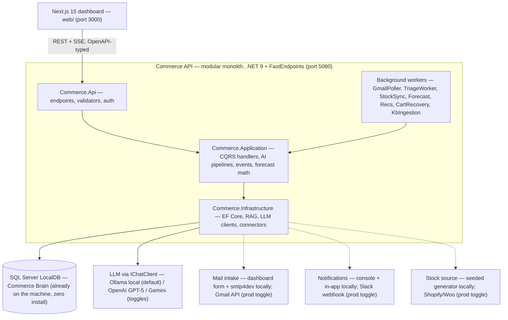
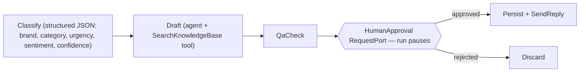
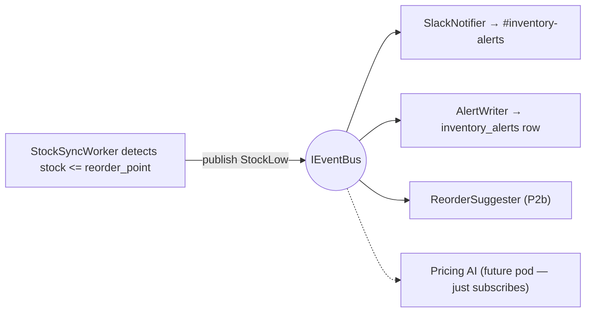
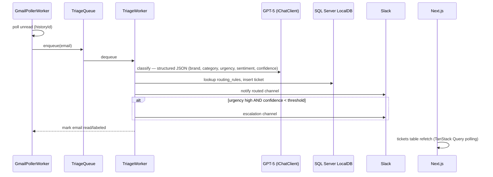
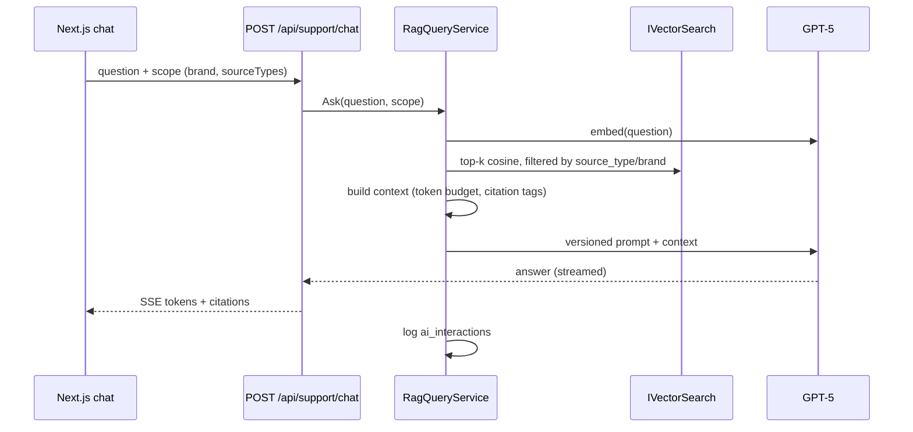

# Commerce — Platform Architecture (Backend + Frontend)

**Sources reconciled:**
- [archtecture.txt](../archtecture.txt) — target spec (.NET 9, FastEndpoints, Clean Architecture, pgvector, Next.js 15)
- [00-overview.md](00-overview.md) + pod plans — build order and week-1 scope
- `C:\Step2Gen\AIFramwork\AIFramework\SupportDeskAI` — reference implementation whose patterns we port (agent workflow graph, human-in-the-loop approval, queue + background worker, grounded drafting)

**Initial scope (this plan):** [Support AI](support-ai-plan.md) → [Inventory AI](inventory-ai-plan.md) → [Shopping AI](shopping-ai-plan.md). The other four pods (Analytics, Pricing, Warehouse, Marketing) slot in later without core changes (§8).

---

## 1. Decisions up front

Where `archtecture.txt` and the md plans disagree, this table is the ruling:

| # | Decision | Why | Deferred alternative |
|---|----------|-----|----------------------|
| 1 | **SQL Server LocalDB** (`(localdb)\MSSQLLocalDB`) — per md plans; no Docker, no installs, ships with Visual Studio | User constraint: everything local, no Docker. LocalDB is already on the machine. Vector search: LocalDB (SQL 2019) has no vector type, so embeddings live in an `Embeddings` table as `VARBINARY` and similarity is **in-memory cosine in C#** behind an `IVectorSearch` abstraction — single-digit milliseconds at demo scale (thousands of chunks). | Swap `IVectorSearch` for SQL Server 2025 native `VECTOR`, or PostgreSQL + pgvector, at deployment — feature code unchanged, re-run ingestion. |
| 2 | **Modular monolith** — one FastEndpoints service, pods as feature modules | Per `00-overview.md`: one API handles reads + writes; n8n removed; no service mesh for a 3-pod start. Module boundaries = future microservice seams. | Extract a pod to its own service when scale demands; the bus (decision 3) is the seam. |
| 3 | **In-process event bus** (`Channel<T>` fan-out behind `IEventBus`) | md plans explicitly keep everything in-process. Event *contracts* are defined now, so features are written event-driven from day 1. | RabbitMQ implementation of `IEventBus` + transactional outbox in Phase 4. Zero feature-code changes. |
| 4 | **No Redis yet** — .NET 9 `HybridCache` with in-memory backend | Nothing at demo scale needs a distributed cache. | Point `HybridCache` at Redis in Phase 4 (config change). |
| 5 | **LLM behind `Microsoft.Extensions.AI`** (`IChatClient` + `IEmbeddingGenerator`) — **local Ollama by default**, cloud as toggle | Everything runs on this machine at zero cost: Ollama (`llama3.1`/`qwen2.5` chat, `nomic-embed-text` embeddings) via OllamaSharp, which implements the same interfaces. SupportDeskAI proves the abstraction. Provider is config, not code — OpenAI GPT-5 (spec target) or Gemini are drop-ins when a key is present. | — |
| 6 | **Microsoft Agent Framework workflows** for human-in-the-loop pipelines | Direct port of SupportDeskAI's proven `WorkflowBuilder` + `RequestPort` approval pattern (spec: "AI Draft Replies — agent approval required"). | — |
| 7 | **Math for forecasting/recommendations, LLM only for language** | Per md plans: moving average / co-occurrence SQL — cheaper, deterministic, explainable. LLM explains anomalies and answers copilot questions; it never does the arithmetic. | Upgrade forecast to Holt-Winters / ML.NET later; API shape doesn't change. |
| 8 | **CQRS via FastEndpoints command bus** (no MediatR) | FastEndpoints ships `ICommand`/`ICommandHandler`; one less library, same handler separation. | — |
| 9 | **Auth: static bearer key in Phase 1 → full JWT + refresh + RBAC in Phase 4** | Per support plan ("simple API key for the demo"). The endpoint `Roles(...)` declarations are written from day 1 so flipping to JWT is config, not rework. | — |
| 10 | **Local-first runtime** — the whole stack runs offline on one machine | Every external dependency has a local substitute wired behind an existing abstraction: LLM → Ollama; ticket intake → dashboard submit form (+ optional smtp4dev); stock/sales source → seeded data generator; notifications → console + in-app. Gmail, Slack, Shopify, OpenAI are **opt-in config toggles**, never prerequisites. | Flip toggles per integration when credentials/accounts are ready — no code changes. |

---

## 2. System overview



Dashed edges are the config toggles from decision 10 — the local substitute is the default, the cloud service activates when credentials exist.

One deployable API, one database. Each pod (Support, Inventory, Shopping) is a vertical slice: its own feature folders, its own tables, communicating with other pods **only** via the event bus and shared Commerce Brain tables — that discipline is what lets Pricing/Warehouse/etc. bolt on later, and lets any pod be extracted to a service if ever needed.

---

## 3. Backend architecture

### 3.1 Solution layout

Projects exactly as the spec names them:

```
Commerce/
├── Commerce.sln
├── src/
│   ├── Commerce.Api/                   # FastEndpoints host — thin HTTP edge
│   │   ├── Features/
│   │   │   ├── Support/                # one folder per endpoint (REPR)
│   │   │   │   ├── Triage/  Tickets/  TicketById/  GenerateDraft/
│   │   │   │   ├── Review/  ReviewApprove/  ReviewReject/
│   │   │   │   ├── Chat/  RoutingRules/
│   │   │   ├── Inventory/
│   │   │   │   ├── Products/  Forecast/  Health/  ReorderSuggestions/
│   │   │   │   ├── Alerts/  Copilot/  Sync/
│   │   │   ├── Shopping/
│   │   │   │   ├── Search/  Recommendations/  TrackEvent/
│   │   │   │   ├── Assistant/  Compare/  Trending/
│   │   │   └── Platform/
│   │   │       ├── Auth/  Status/  KbIngest/  AiUsage/
│   │   ├── Workers/                    # hosted-service registrations (logic lives below)
│   │   └── Program.cs                  # composition root: DI, auth, CORS, swagger
│   │
│   ├── Commerce.Application/           # use cases — no EF, no HTTP, no SDKs
│   │   ├── Features/{Support,Inventory,Shopping}/   # command/query handlers mirroring Api slices
│   │   ├── Ai/
│   │   │   ├── Pipelines/              # workflow + RAG + copilot contracts (§3.4)
│   │   │   └── Prompts/                # versioned prompt templates (const string + version)
│   │   ├── Events/                     # event contracts: TicketCreated, StockLow, …
│   │   ├── Forecasting/                # pure math: moving average, safety stock, reorder point
│   │   └── Abstractions/               # IRepository<T>, IEventBus, IRagRetriever, ISlackNotifier, …
│   │
│   ├── Commerce.Domain/                # entities, enums, invariants — zero dependencies
│   ├── Commerce.Infrastructure/        # implementations of Application abstractions
│   │   ├── Persistence/                # DbContext, EF configs, migrations, embedding byte[] mapping
│   │   ├── Ai/                         # LlmClientFactory, RagRetriever, embedding ingestion,
│   │   │   └── Workflows/              #   Agent Framework graphs (SupportDraftWorkflow, …)
│   │   ├── Integrations/               # GmailClient, SlackWebhook, ShopifyConnector, …
│   │   ├── Messaging/                  # InProcessEventBus (Channel<T>)  [RabbitMqEventBus P4]
│   │   └── Workers/                    # BackgroundService implementations
│   └── Commerce.Shared/                # Result<T>, error codes, pagination, shared constants
├── tests/
│   ├── Commerce.UnitTests/             # handlers, forecast math, prompt builders
│   └── Commerce.IntegrationTests/      # LocalDB-backed endpoint tests
└── web/                                # Next.js 15 (§5)
```

**Dependency rule:** `Api → Application → Domain`. `Infrastructure` implements `Application` abstractions and is referenced only by `Api` for DI composition. `Shared` is referenced by all.

### 3.2 Feature anatomy (REPR + CQRS)

Every feature is a self-contained slice, per the spec's required structure (Endpoint, Request, Response, Validator, Handler, Repository, Specification-if-needed):

```
Commerce.Api/Features/Support/Triage/
├── TriageEndpoint.cs        # route, verb, roles — maps request to command
├── TriageRequest.cs
├── TriageResponse.cs
└── TriageValidator.cs       # FluentValidation (built into FastEndpoints)

Commerce.Application/Features/Support/Triage/
├── TriageCommand.cs         # ICommand<TriageResult>
└── TriageHandler.cs         # classification pipeline + RoutingRules lookup +
                             #   EF save (via repository) + publish TicketCreated
```

```csharp
public sealed class TriageEndpoint : Endpoint<TriageRequest, TriageResponse>
{
    public override void Configure()
    {
        Post("/api/support/triage");
        Roles(nameof(Role.Admin), nameof(Role.SupportAgent)); // enforced once JWT lands (P4)
    }

    public override async Task HandleAsync(TriageRequest req, CancellationToken ct)
        => Response = TriageResponse.From(
            await new TriageCommand(req.Subject, req.Body, req.Sender).ExecuteAsync(ct));
}
```

- **Commands/queries** ride FastEndpoints' built-in command bus — handlers live in `Commerce.Application`, endpoints stay 5-line thin.
- **Repositories** are interfaces in Application, EF Core implementations in Infrastructure.
- **Specifications** via `Ardalis.Specification` for composable list filters (ticket table filters, inventory health queries).

### 3.3 What we port from SupportDeskAI

This is the explicit mapping of the reference project onto Commerce — the workflow/HITL engine graduates unchanged; storage moves file → SQL Server, retrieval moves keyword → semantic vector search, provider moves Gemini → OpenAI behind the same interface:

| SupportDeskAI (reference) | Commerce equivalent |
|---|---|
| `TicketQueue` — unbounded `Channel<T>` intake | Same pattern behind `IWorkQueue<T>`; one queue per pipeline (triage, ingestion) |
| `TicketWorker` — `BackgroundService` driving `InProcessExecution.RunStreamingAsync`, parking paused runs | `TriageWorker` in Infrastructure hosting `SupportDraftWorkflow` runs; identical park-and-continue handoff |
| Workflow graph: Triage → Resolver → QA → `RequestPort` → approved/rejected branches | `SupportDraftWorkflow`: Classify → Draft (KB tool) → QaCheck → HumanApproval port → Send+Log \| Discard |
| `RequestPort.Create<TReq,TResp>` + `RequestInfoEvent` pause | Same — the human-approval pause point, verbatim pattern |
| `ApprovalCoordinator` — `TaskCompletionSource` map + restart fallback | Same class; decision state additionally persisted on `ticket_drafts.status` so an app restart degrades to the direct-apply fallback (already designed in the reference) |
| `PendingTicketStore` — `action_required.json` | `ticket_drafts` table (status `pending/approved/rejected`) via EF Core |
| `KnowledgeBaseService` — keyword search over `kb.json` | `RagRetriever` — cosine top-k over the `Embeddings` table (`IVectorSearch`), filtered by source type/brand |
| `AIFunctionFactory.Create(SearchKnowledgeBase)` tool on the resolver | Same tool shape registered on the Draft agent, now backed by vector search |
| `AgentFactory` — Gemini `IChatClient` per stage | `LlmClientFactory` — OpenAI `IChatClient` + `IEmbeddingGenerator`; Gemini drop-in via config |
| `PipelineRunner.RetryAsync` — 429/503 exponential backoff | Retry decorator on the LLM client (Polly), same 15→30→60s policy; every call logged to `ai_interactions` |
| `/api/review/{id}/approve` \| `/discard` minimal APIs | `Features/Support/ReviewApprove` / `ReviewReject` FastEndpoints slices |
| `wwwroot/index.html` single-file SPA | Next.js dashboard (§5) |
| `/api/status` worker pill + graph highlight | `GET /api/status` polled by the dashboard header, same UX |

### 3.4 AI layer — four archetypes

All LLM access goes through `IChatClient`/`IEmbeddingGenerator` (Microsoft.Extensions.AI). Model names, temperature, and prompt versions are config. Every call writes an `ai_interactions` row (§3.9).

**Provider profiles** (decision 5/10 — same code, different config):

| Profile | Chat | Embeddings | Notes |
|---|---|---|---|
| `local` (default) | Ollama `llama3.1:8b` or `qwen2.5:7b` via OllamaSharp | Ollama `nomic-embed-text` (768-dim) | Free, offline. Both models handle tool calling (copilot, KB tool) and JSON-schema structured output (classify). CPU works; a GPU makes drafts feel instant. |
| `openai` (spec target) | GPT-5 | `text-embedding-3-small` with `dimensions: 768` | Flip when quality matters (client demo of long drafts, nuanced classification). |
| `gemini` | Gemini (key already on hand from SupportDeskAI) | — | Chat-only fallback; embeddings stay on the configured embedding provider. |

**A. Human-in-the-loop approval workflow** (Agent Framework graph — the SupportDeskAI port). Used by Support draft replies in Phase 1b; reused later for Inventory purchase-order approval and Pricing price-change approval:



**B. Shared RAG query pipeline** — built once in Infrastructure, consumed by three features (Support chat, Shopping assistant, KB search). This is the spec's "AI Pipeline" made concrete:

`embed(question)` → `IVectorSearch` top-k (filtered by `source_type`, brand) → context builder (token budget, citation tags) → prompt builder (versioned template) → GPT-5 → answer + citations → log.

**C. Tool-calling copilot** (Inventory Copilot). *Not* RAG — inventory numbers must come from SQL, not embeddings. The agent gets deterministic functions (`GetLowStock()`, `GetForecast(sku)`, `GetDeadStock()`, `GetOverstock()`) and composes the natural-language answer. Same `AIFunctionFactory` pattern as the reference's KB tool.

**D. Non-LLM analytics jobs** (decision 7). Demand forecast = weekly moving average → exponential smoothing (pure C# in `Application/Forecasting`, unit-testable). Recommendations = "frequently bought together" SQL co-occurrence materialized nightly. LLM's only role here: explaining anomalies and copilot answers.

### 3.5 Data model (SQL Server LocalDB, EF Core 9 migrations from day 1)

**Commerce Brain — shared core** (spec's shared layer; every pod reads, owning pod writes):

| Table | Purpose / key columns |
|---|---|
| `products` | id, brand, sku, name, description, category_id, price, attributes `jsonb` |
| `categories`, `customers`, `orders`, `order_items` | standard commerce core |
| `inventory` | product_id, warehouse_id, current_stock, safety_stock, reorder_point, lead_time_days |
| `warehouses`, `suppliers`, `purchase_orders` | fulfillment core (light until Warehouse AI) |
| `knowledge_articles` | id, title, body, source_type (faq/policy/manual/article), brand |
| `embeddings` | polymorphic chunk store — see DDL below |
| `users`, `refresh_tokens` | auth (P4) |
| `ai_interactions` | observability (§3.9) |
| `audit_logs` | entity, action, actor, before/after `jsonb` |

**Pod-owned tables:**

| Pod | Tables |
|---|---|
| Support | `tickets` (brand, category, urgency, sentiment, confidence, subject, body, sender, status, assigned_team), `ticket_drafts` (ticket_id, draft_reply, qa_feedback, status, decided_by), `routing_rules` (brand, category, urgency_threshold, target_team, slack_channel) |
| Inventory | `stock_movements` (sku, delta, reason, source, ts), `demand_forecasts` (sku, horizon_days 7/30/90, week_start, predicted_units, confidence), `inventory_alerts` (type, sku, severity, message, acknowledged), `reorder_suggestions` (sku, supplier_id, qty, order_by_date, rationale) |
| Shopping | `customer_events` (customer_id, sku, event_type view/cart/purchase, ts), `recommendations` (customer_id, sku, score, source, generated_at), `abandoned_carts` (cart_id, customer_id, skus `jsonb`, last_active_at, recovery_email_sent) |

**One polymorphic embeddings table** (rather than per-source tables), with similarity computed in-process:

```sql
CREATE TABLE Embeddings (
    Id           BIGINT IDENTITY PRIMARY KEY,
    SourceType   NVARCHAR(32) NOT NULL,      -- product | manual | faq | policy | review | kb_article
    SourceId     UNIQUEIDENTIFIER NOT NULL,
    ChunkIndex   INT NOT NULL,
    Content      NVARCHAR(MAX) NOT NULL,
    MetadataJson NVARCHAR(MAX) NOT NULL DEFAULT '{}',  -- brand, title, url, …
    Vector       VARBINARY(3072) NOT NULL              -- 768 × float32, see note
);
CREATE INDEX IX_Embeddings_Scope ON Embeddings (SourceType, SourceId);
```

**Vector search without a vector database:** LocalDB has no vector type, so `IVectorSearch` loads the scoped chunks (filtered by `SourceType`/brand via SQL) and ranks by cosine similarity in C# — for a demo-scale corpus (thousands of chunks × 768 dims) that's single-digit milliseconds, cached per scope. The abstraction is the upgrade seam: SQL Server 2025 `VECTOR` or pgvector at deployment, feature code untouched.

**Why 768 dims everywhere:** `nomic-embed-text` (local Ollama) is 768-dim natively, and OpenAI's `text-embedding-3-small` accepts `dimensions: 768` at request time — one schema serves both provider profiles. Rule: all vectors in one table must come from the same model; switching embedding models means re-running ingestion (a `KbIngestionWorker` replay, not a schema change).

EF Core mapping via `Pgvector.EntityFrameworkCore`; ingestion (chunk → metadata → embed → upsert) runs on `KbIngestionWorker`, triggered by `POST /api/kb/ingest` or a `KbDocumentIngested` event.

### 3.6 API surface (v1)

All routes under `/api`, camelCase JSON, OpenAPI/Swagger emitted (feeds frontend codegen, §5.3). Phase tags refer to §7.

**Support**

| Method & route | Purpose | Phase |
|---|---|---|
| `POST /support/triage` | Classify + route one message (called by GmailPoller in-process, or externally) | 1a |
| `GET /support/tickets?team=&status=&urgency=&brand=` | Filterable ticket table | 1a |
| `GET /support/tickets/{id}` | Detail incl. classification + draft | 1a |
| `GET/POST/PUT /support/routing-rules` | Routing config CRUD | 1a |
| `POST /support/tickets/{id}/draft` | Generate AI draft reply (enters workflow A) | 1b |
| `GET /support/review` | Action-required drafts awaiting approval | 1b |
| `POST /support/review/{id}/approve` \| `/reject` | Resume paused workflow run | 1b |
| `POST /support/chat` | RAG over FAQs/policies/KB (SSE stream) | 1b |

**Inventory**

| Method & route | Purpose | Phase |
|---|---|---|
| `GET /inventory/products` | Stock levels per SKU/brand | 2a |
| `GET /inventory/forecast?sku=&horizon=7\|30\|90` | Demand forecast series | 2a |
| `POST /inventory/sync` | Manual trigger of brand-platform sync | 2a |
| `GET /inventory/alerts` | Predictive alerts (low/dead/overstock, supplier delay) | 2a |
| `GET /inventory/health` | Health dashboard: fast/slow/dead/over/low + value + score | 2b |
| `GET /inventory/reorder-suggestions` | When/how-much/which-supplier | 2b |
| `POST /inventory/copilot` | NL Q&A via tool-calling agent (SSE) | 2b |

**Shopping**

| Method & route | Purpose | Phase |
|---|---|---|
| `POST /shopping/events` | Track view/cart/purchase from storefront | 3a |
| `GET /shopping/recommendations?customerId=` | Stock-aware recommendations | 3a |
| `GET /shopping/trending` | Trending products | 3a |
| `GET /shopping/search?q=` | Semantic product search (embed query → kNN → join stock/price) | 3b |
| `POST /shopping/assistant` | RAG shopping assistant (catalog/manuals/reviews/FAQs, SSE) | 3b |
| `POST /shopping/compare` | AI product comparison | 3b |

**Platform**

| Method & route | Purpose | Phase |
|---|---|---|
| `GET /status` | Queue depth + current worker stage (dashboard header pill) | 1a |
| `POST /kb/ingest` | Document ingestion into embeddings | 1b |
| `GET /admin/ai-usage` | Aggregates from `ai_interactions` | 1b |
| `POST /auth/login` \| `/auth/refresh` | JWT + refresh tokens | 4 |

### 3.7 Events

Contracts defined in `Commerce.Application/Events` from day 1; carried by `InProcessEventBus` (`Channel<T>` fan-out to registered handlers) now, RabbitMQ + transactional outbox in Phase 4 behind the same `IEventBus`.

Catalog (spec examples + pod plans): `TicketCreated`, `TicketEscalated`, `DraftApproved`, `StockSynced`, `StockLow`, `ForecastUpdated`, `ProductViewed`, `PurchaseCompleted`, `CartAbandoned`, `ReviewAdded`, `OrderCreated`, `OrderCompleted`, `KbDocumentIngested`.

Example flow — one event, multiple pods react, no coupling:



### 3.8 Background workers

All `BackgroundService`s registered in `Commerce.Api/Workers`, implemented in Infrastructure — the reference project's `TicketWorker` hosting pattern throughout:

| Worker | Pod | Trigger | Job |
|---|---|---|---|
| `GmailPollerWorker` | Support | every 60–120 s | **Prod toggle.** `users.messages.list` (`is:unread in:inbox`), track `historyId`, mark read after ticket created, feed triage queue. Locally the same queue is fed by the dashboard submit form / `POST /support/triage` (SupportDeskAI's intake pattern) or an optional smtp4dev poller |
| `TriageWorker` | Support | queue-driven | Run classification (1a) / full draft workflow (1b); park runs at approval port |
| `KbIngestionWorker` | Platform | queue-driven | chunk → metadata → embed → upsert `embeddings` |
| `StockSyncWorker` | Inventory | nightly per brand | **Prod toggle.** Pull stock + sales from Shopify/Woo APIs → `products`, `stock_movements`; publish `StockLow`. Locally a seeded generator produces realistic sales/stock history so forecasts and alerts have data |
| `ForecastWorker` | Inventory | nightly | Moving-average forecast per SKU → `demand_forecasts`; publish `ForecastUpdated` |
| `RecommendationWorker` | Shopping | nightly | Co-occurrence query → `recommendations` |
| `CartRecoveryWorker` | Shopping | hourly | Carts inactive > N h → recovery email (outbound Gmail, reusing Support's client) → mark sent |

### 3.9 Observability (spec requirement)

Every LLM call — from any archetype — logs one row:

`ai_interactions(id, feature, prompt_version, model, input_tokens, output_tokens, latency_ms, cost_usd, success, error, feedback, hallucination_flag, created_at)`

- `prompt_version` comes from the versioned templates in `Application/Ai/Prompts` — prompts are code-reviewed artifacts, not inline strings.
- `cost_usd` computed from token counts × configured price table.
- `feedback` / `hallucination_flag` written back from the dashboard (thumbs up/down on drafts and chat answers).
- Serilog structured logging throughout; OpenTelemetry exporters in Phase 4.
- Surfaced at `GET /admin/ai-usage` → AI Usage dashboard page.

### 3.10 Auth & config

- **Target (Phase 4):** `FastEndpoints.Security` — JWT bearer + refresh tokens (`refresh_tokens` table), roles per spec: `Admin`, `InventoryManager`, `WarehouseStaff`, `SupportAgent`, `Customer`. Endpoints declare `Roles(...)` from day 1.
- **Phase 1 shortcut (per support plan):** single static bearer key middleware + CORS locked to the Next.js origin.
- **Config:** strongly-typed `IOptions<T>` sections — `Llm` (provider: `ollama|openai|gemini`, endpoint, chat model, embedding model), `Intake` (mode: `form|smtp4dev|gmail`), `Notifications` (mode: `local|slack`), `StockSource` (mode: `seed|shopify|woo`), `Jwt`, `Forecasting`. Notifications go through one `INotifier` abstraction — local impl writes console + in-app `notifications` rows the dashboard shows; Slack impl posts webhooks. Secrets (only needed once a cloud toggle is flipped) via user-secrets locally, env vars in deployment — same stack philosophy as the reference `Config.cs`, but typed.

---

## 4. Key sequences

### 4.1 Email → ticket → Slack (Phase 1a — the week-1 demo)



### 4.2 Draft reply with human approval (Phase 1b — the SupportDeskAI port)

```mermaid
sequenceDiagram
    participant W as TriageWorker
    participant WF as SupportDraftWorkflow
    participant DB as SQL Server LocalDB
    participant UI as Next.js (Action Required)
    participant A as Support agent (human)

    W->>WF: RunStreamingAsync(ticket)
    WF->>WF: Classify → Draft (SearchKnowledgeBase tool) → QaCheck
    WF-->>W: RequestInfoEvent at HumanApproval port (run pauses)
    W->>DB: ticket_drafts.status = pending
    W->>W: register ApprovalCoordinator waiter, hand off run, next ticket
    A->>UI: reviews draft + QA feedback
    UI->>W: POST /support/review/{id}/approve
    W->>WF: SendResponseAsync(ApprovalDecision approved)
    WF->>DB: persist resolved, send reply
    Note over W,WF: reject → Discard branch; app restarted → DB-status fallback applies decision directly
```

### 4.3 RAG ask (shared pipeline — Support chat, Shopping assistant)



---

## 5. Frontend architecture (`web/`, Next.js 15)

### 5.1 Stack & conventions

- **Next.js 15 App Router + TypeScript**, React 19. The dashboard is interaction-heavy, so pages are mostly client components hydrated via TanStack Query; RSC used for shells and static reads.
- **Tailwind CSS + shadcn/ui** for all UI primitives; **ECharts** for charts (recommended over Chart.js — better time-series zoom/brush for forecasts and theming; spec allows either).
- **TanStack Query** owns all server state. **Zustand** owns client-only state (sidebar, active filters, chat composer). Server data never lives in Zustand.
- **React Hook Form + zod** for every form; zod schemas colocated per feature.
- **API types generated from the backend's OpenAPI** (`openapi-typescript` against the FastEndpoints swagger doc) — the API is the single source of truth for DTOs.

### 5.2 Folder structure

```
web/
├── src/
│   ├── app/
│   │   ├── (auth)/login/page.tsx
│   │   ├── (dashboard)/
│   │   │   ├── layout.tsx                  # sidebar + header (status pill from GET /api/status)
│   │   │   ├── page.tsx                    # executive dashboard
│   │   │   ├── support/
│   │   │   │   ├── page.tsx                # ticket table + filters (team/status/urgency/brand)
│   │   │   │   ├── [id]/page.tsx           # ticket detail: classification, draft, approve/reject
│   │   │   │   └── chat/page.tsx           # KB chat (RAG, streaming)
│   │   │   ├── inventory/
│   │   │   │   ├── page.tsx                # health dashboard: score, fast/slow/dead/over, value
│   │   │   │   ├── forecast/page.tsx       # 7/30/90-day charts per SKU
│   │   │   │   ├── reorders/page.tsx       # reorder suggestions table
│   │   │   │   └── copilot/page.tsx        # NL copilot chat
│   │   │   ├── shopping/
│   │   │   │   ├── page.tsx                # semantic search + recommendation cards + trending
│   │   │   │   └── assistant/page.tsx      # AI shopping assistant + comparison
│   │   │   ├── products/  orders/  customers/  analytics/  settings/
│   │   └── api/auth/[...auth]/route.ts     # login proxy → API, sets httpOnly cookies
│   ├── features/                           # mirror of backend pods
│   │   ├── support/    {components/, hooks/, api.ts, schemas.ts}
│   │   ├── inventory/  {…}
│   │   ├── shopping/   {…}
│   │   └── platform/   {…}
│   ├── components/
│   │   ├── ui/                             # shadcn primitives
│   │   └── shared/                         # DataTable, StatCard, PageHeader, ChartCard,
│   │                                       #   ConfidenceBadge, UrgencyBadge, EmptyState
│   ├── lib/
│   │   ├── api/client.ts                   # fetch wrapper: base URL, auth header, error shape
│   │   ├── api/gen/                        # openapi-typescript output (generated, not edited)
│   │   ├── query-client.ts                 # defaults: staleTime, retry, key factory
│   │   └── sse.ts                          # useSseChat — fetch ReadableStream hook
│   ├── stores/                             # zustand: ui.ts (sidebar/theme), filters.ts
│   └── types/
├── tailwind.config.ts
└── next.config.ts
```

### 5.3 Data layer conventions

- **Query keys:** `['support','tickets',filters]`, `['inventory','forecast',sku,horizon]`, `['shopping','recommendations',customerId]`. Mutations invalidate their pod prefix.
- **Live updates:** polling first (tickets table + `/api/status` every 5–10 s — the reference dashboard's proven UX), SSE for chat/copilot streaming from day 1 of those features. WebSockets not needed.
- **Auth:** login page → Next route handler → API; tokens in httpOnly cookies; `middleware.ts` guards the `(dashboard)` group; role claims drive nav visibility (e.g. `InventoryManager` doesn't see Support review queue).
- **Codegen loop:** `pnpm gen:api` pulls `http://localhost:5080/swagger/v1/swagger.json` → regenerates `lib/api/gen/`. Run after any backend contract change; CI check enforces drift-free.

### 5.4 Page ↔ API map (initial pods)

| Page | Primary calls | Phase |
|---|---|---|
| Support tickets | `GET /support/tickets` (+ filters), `GET /status`, submit form → `POST /support/triage` (local intake) | 1a |
| Ticket detail | `GET /support/tickets/{id}`, `POST /support/tickets/{id}/draft`, `POST /support/review/{id}/approve\|reject` | 1a / 1b |
| Support chat | `POST /support/chat` (SSE) | 1b |
| Inventory health | `GET /inventory/health`, `GET /inventory/alerts` | 2 |
| Forecast | `GET /inventory/forecast` (ECharts line + confidence band) | 2 |
| Reorders | `GET /inventory/reorder-suggestions` | 2b |
| Copilot | `POST /inventory/copilot` (SSE) | 2b |
| Shopping home | `GET /shopping/search`, `GET /shopping/recommendations`, `GET /shopping/trending` | 3 |
| Assistant | `POST /shopping/assistant` (SSE), `POST /shopping/compare` | 3b |
| Executive dashboard | aggregates of the above + `GET /admin/ai-usage` | grows per phase |

---

## 6. Local development — the whole platform offline

Everything runs on this machine with zero cloud accounts and zero API spend. Each external dependency maps to a local substitute (decision 10):

**No Docker anywhere.** Every piece is a native Windows install or already on the machine:

| Dependency | Local default | Cloud toggle (later) |
|---|---|---|
| LLM + embeddings | **Ollama** — native Windows app (uses GPU if present), `http://localhost:11434`; `ollama pull llama3.1:8b` + `nomic-embed-text` | OpenAI GPT-5 / Gemini via config |
| Database | **SQL Server LocalDB** `(localdb)\MSSQLLocalDB` — already installed, auto-starts on first connection | SQL Server / managed DB |
| Vector search | In-memory cosine over the `Embeddings` table (`IVectorSearch`) | SQL Server 2025 `VECTOR` / pgvector |
| Ticket intake | Dashboard **submit form** → `POST /support/triage` (+ optional smtp4dev, a `dotnet tool install -g Rnwood.Smtp4dev` — no container) | Gmail API poller |
| Notifications | Console + in-app `notifications` panel | Slack webhooks |
| Stock & sales history | **Seed generator** — deterministic fake brands/SKUs/orders with seasonality, so forecasts, health scores, and recommendations are demonstrable | Shopify / WooCommerce sync |
| Outbound email (cart recovery, replies) | smtp4dev local UI catches all mail | Gmail API send |

- API: `dotnet run --project src/Commerce.Api` → `http://localhost:5080` (swagger at `/swagger`). Migrates the DB and seeds demo data automatically when empty.
- Web: `npm run dev` in `web/` → `http://localhost:3000`
- Redis + RabbitMQ enter only at real deployment (Phase 4) — never required locally.

---

## 7. Implementation roadmap

Build order per [00-overview.md](00-overview.md): Support first (fastest, becomes the client demo), Inventory (foundational), Shopping last (needs Inventory's stock to be meaningful). Definitions of done lifted from the pod plans.

### Phase 0 — Scaffold (~2 days)
Solution + 5 projects + FastEndpoints skeleton with one health endpoint; EF Core + first migration (Commerce Brain core tables) on LocalDB; `IEventBus` (in-process) + `IWorkQueue<T>`; `LlmClientFactory` + retry decorator + `ai_interactions` logging; Next.js shell — sidebar layout, shadcn setup, query client, OpenAPI codegen wired; CI: build + test + codegen drift check.

### Phase 1a — Support AI core (week 1, per [support-ai-plan.md](support-ai-plan.md), local mode)
| Day | Deliverable |
|---|---|
| Setup | Ollama installed, models pulled (`llama3.1:8b`, `nomic-embed-text`); compose up; seed data |
| Mon | `tickets` + `routing_rules` migrations; ticket/rules feature slices |
| Tue | Intake: dashboard submit form + `POST /support/triage`; optional smtp4dev poller; triage queue + worker |
| Tue–Wed | Classify pipeline — structured JSON `{brand, category, urgency, sentiment, confidence}`; routing lookup; ticket persisted; `TicketCreated` published |
| Thu | `INotifier` — console + in-app notifications panel; escalation branch (`urgency=high AND confidence<threshold`) |
| Fri | Dashboard: ticket table + filters, status pill; CORS + static bearer key |
| Sat–Sun | E2E across all 5 seeded brands; prompt refinement on the local model; demo script |

**DoD (local):** ticket submitted via form or smtp4dev → classified ticket in SQL Server within seconds → routed notification visible in-app → dashboard filters work, all 5 brands.
**Gmail/Slack toggles** (when accounts are ready, any later day): GCP project + Gmail OAuth refresh token, `Intake:mode=gmail`; Slack webhook URLs, `Notifications:mode=slack`. No code changes — this restores the original plan's DoD ("new email → ticket → correct Slack channel within ~2 min").

### Phase 1b — Support AI intelligence
`SupportDraftWorkflow` (archetype A) + `ticket_drafts` + review endpoints + Action Required UI; KB ingestion pipeline + `embeddings`; `RagQueryService` + Support chat (SSE); sentiment already in classify output — wire escalation on `negative+urgent`; AI usage endpoint + page.

### Phase 2 — Inventory AI (per [inventory-ai-plan.md](inventory-ai-plan.md))
**2a:** `products`/`stock_movements` migrations; seed generator produces per-brand stock + sales history (platform API access moves to the toggle list — no longer a blocking dependency); `ForecastWorker` (moving average → `demand_forecasts`); products + forecast endpoints & pages; `StockLow` → `INotifier` reusing the Phase 1 handler.
**DoD (local):** seeded stock for all brands queryable via API; basic forecast per SKU; low-stock alert fires in-app. **Shopify/Woo toggle:** confirm per-brand API access, flip `StockSource:mode` — the original "syncs automatically from the real platform" DoD lands then.
**2b:** health score + fast/slow/dead/overstock classification; reorder engine (safety stock + lead time + forecast math); Copilot (archetype C); forecast charts + health dashboard UI.

### Phase 3 — Shopping AI (per [shopping-ai-plan.md](shopping-ai-plan.md))
**3a:** `customer_events` + storefront tracking endpoint; nightly co-occurrence `RecommendationWorker`; recommendations endpoint **joined against live Inventory stock** (price from `products` until a Pricing pod exists); `CartRecoveryWorker` — outbound mail to smtp4dev locally (inspect recovery emails in its UI), Gmail send on toggle.
**DoD:** storefront gets stock-aware, correctly-priced suggestions; abandoned-cart emails send automatically (visible in smtp4dev locally).
**3b:** product embeddings ingestion; semantic search (embed → kNN → join stock/price, LLM-extracted filters like "under $1200"); shopping assistant (RAG over catalog/manuals/reviews/FAQs); comparison; trending.

### Phase 4 — Hardening
Full JWT + refresh + RBAC (flip the `Roles(...)` declarations on); RabbitMQ `IEventBus` + transactional outbox; Redis behind `HybridCache`; OpenTelemetry; executive + analytics dashboards; backup/restore + deployment runbook.

---

## 8. Extending with new pods (spec requirement: no core changes)

A new pod — Pricing AI, Warehouse AI, Marketing AI, Analytics AI — is, by construction:

1. New feature folders under `Features/<Pod>` (Api + Application),
2. New pod-owned tables (own migration),
3. Subscriptions to existing events + new published events,
4. Reuse of the shared AI archetypes (RAG service, HITL workflow, copilot pattern, `ai_interactions` logging),
5. New nav group + `features/<pod>/` folder in the Next.js app.

Nothing in existing pods or the core changes. Example: **Pricing AI** subscribes to `StockLow` + `ForecastUpdated`, owns `price_proposals`, and reuses the HITL approval workflow for price-change sign-off — the same graph Support uses for drafts. If a pod ever needs independent scale, its folder + tables + the event bus are the extraction seam.
